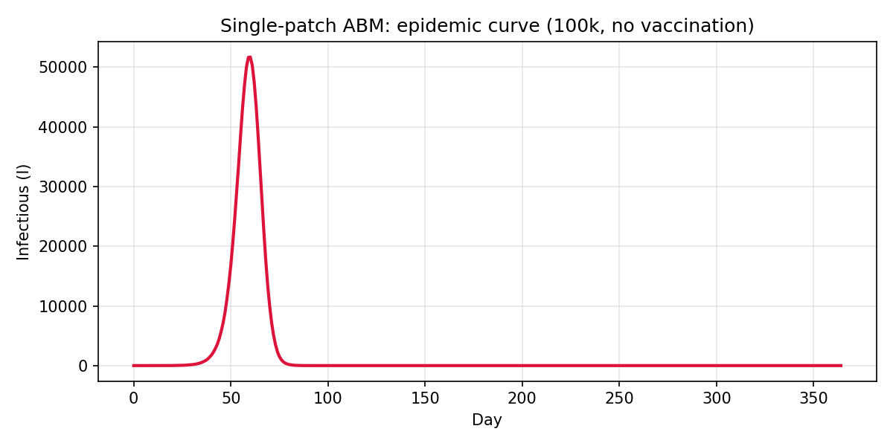
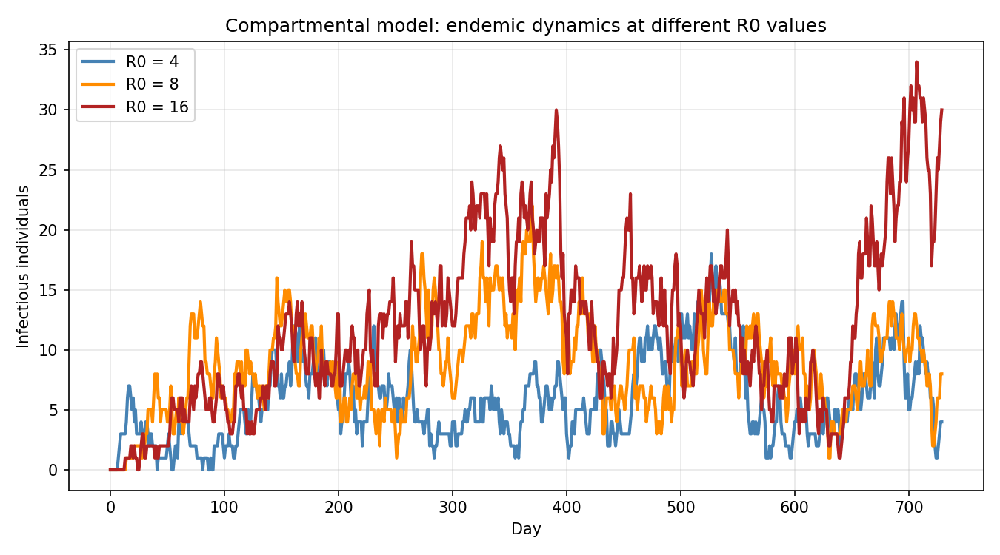
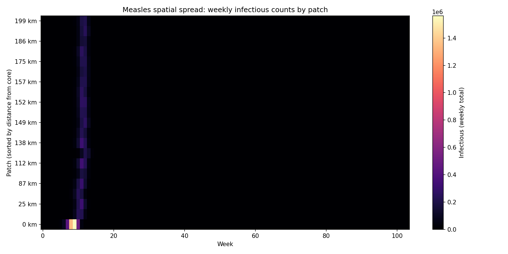
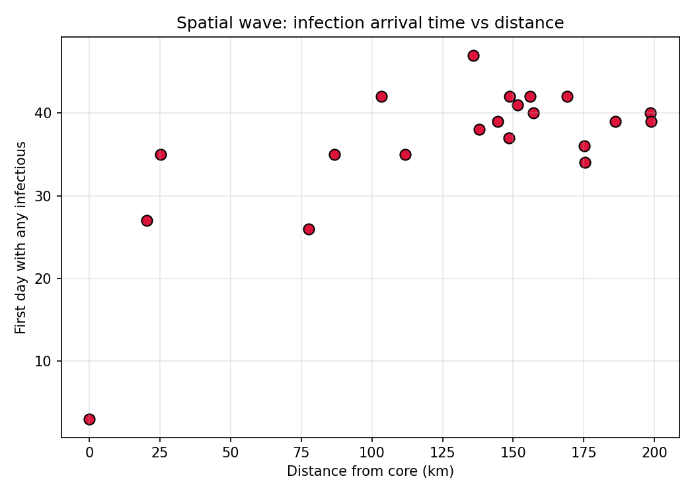
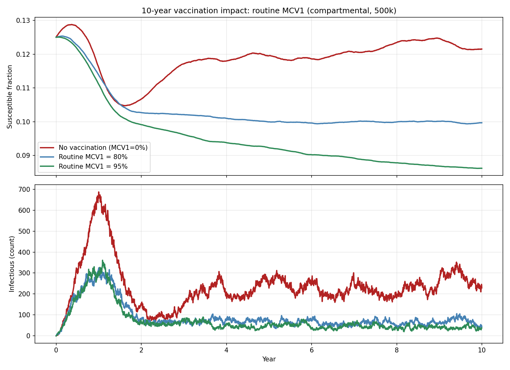
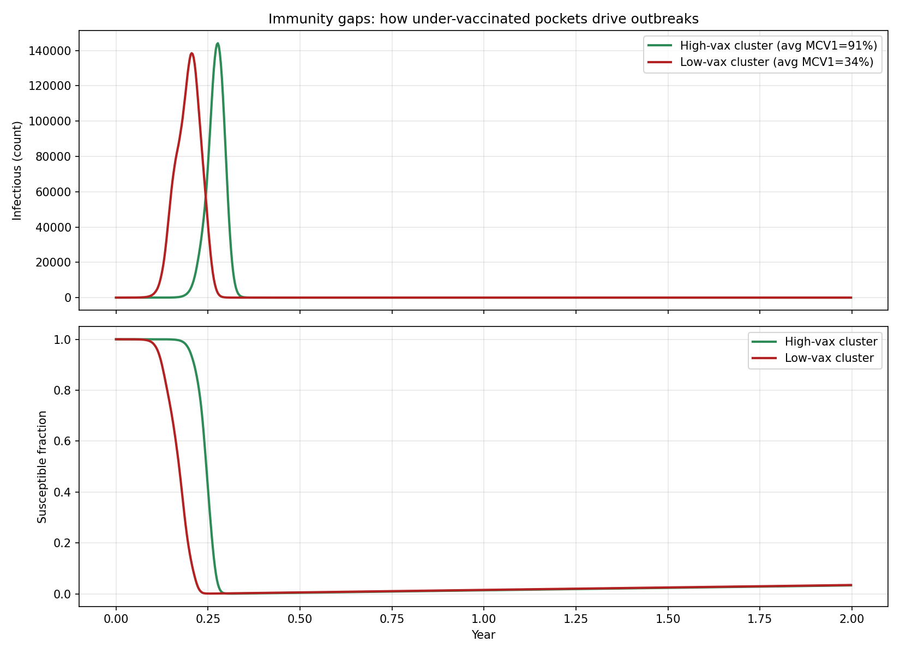
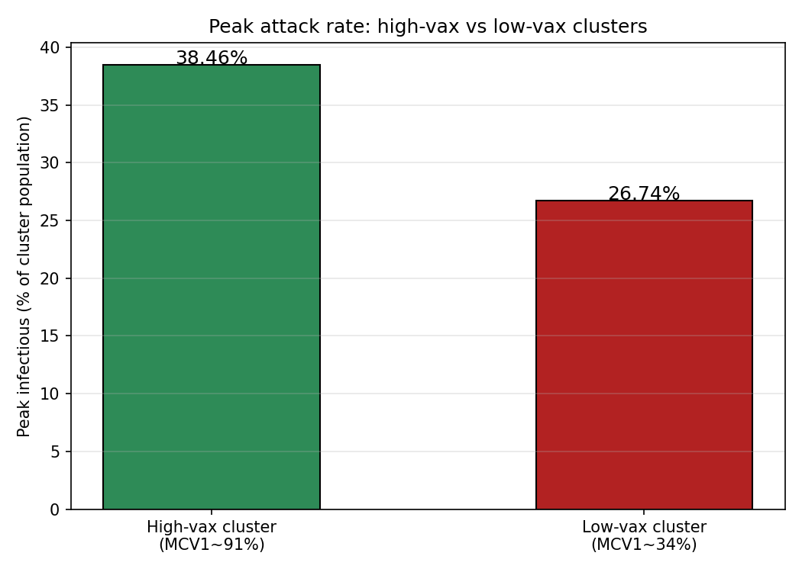

# Progressive Measles Modeling with LASER

A series of five models of increasing complexity, built with the
`laser-measles` framework. Each model adds a new dimension — spatial
structure, transmissibility variation, vaccination strategies, or
immunity heterogeneity — to build intuition about measles dynamics.

## Model 1: Single-patch epidemic burn-through

**File:** `01_single_patch_outbreak.py`

The simplest case: 100,000 fully susceptible individuals in a single
well-mixed population, no vaccination, simulated for 1 year with the
stochastic ABM.

**Result:** A classic SIR epidemic curve. The outbreak peaks around day
55-60 with ~51,000 simultaneously infectious — over half the population.
The epidemic exhausts susceptibles within ~100 days and burns out
completely. This is measles in a naive population: explosive, fast, and
nearly universal infection.

---

## Model 2: How R0 shapes endemic equilibrium

**File:** `02_r0_comparison.py`

Three deterministic compartmental (SEIR) models on the same 100k
single-patch population, initialized at endemic equilibrium for R0 = 4,
8, and 16. Runs for 2 years.

**Result:** Higher R0 produces a larger standing pool of infectious
individuals and more frequent oscillations around equilibrium. At R0=16
(the upper end of measles estimates), the endemic infectious count is
roughly 4x that of R0=4. The oscillations reflect the interplay between
susceptible replenishment via births and depletion via infection — the
hallmark of endemic measles dynamics.

---

## Model 3: Spatial spread from a core city

**File:** `03_spatial_spread.py`

A hub-and-satellite geography: one core city (500k) surrounded by 20
satellite towns (~50k each), with 50% MCV1 coverage. Gravity-based
spatial mixing governs cross-patch transmission. ABM, 2 years.

**Result:** The heatmap of weekly infectious counts by patch (ordered by
distance from the core) shows a clear spatial wave: infection ignites in
the core city and propagates outward. The scatter plot of first-infection
day vs. distance from core confirms the wave pattern — more distant
patches are infected later. Gravity mixing means nearby satellites are
hit quickly while distant ones may escape entirely or experience delayed,
attenuated outbreaks.

---

## Model 4: Vaccination impact over a decade

**File:** `04_vaccination_impact.py`

Three 10-year compartmental runs on a 500k population initialized at
endemic equilibrium (R0=8), comparing: no vaccination, 80% routine MCV1,
and 95% routine MCV1.

**Result:** Routine MCV1 vaccinates only **newborns**, so population-level
impact builds slowly as vaccinated cohorts replace unvaccinated ones. At
80% MCV1, the susceptible fraction drops modestly over 10 years and
endemic transmission persists (though dampened). At 95% MCV1, susceptibles
decline more steeply and infectious counts fall substantially by year 5-6.
The key insight: routine immunization alone takes years to shift
population immunity — it cannot prevent near-term outbreaks in a population
with existing susceptibility gaps.

---

## Model 5: Immunity gaps and spatial heterogeneity

**File:** `05_immunity_gaps.py`

The most policy-relevant model. Two geographic clusters of 10 nodes each,
connected by gravity mixing. Cluster 1 has high vaccination (MCV1 ~91%),
Cluster 2 has low vaccination (MCV1 ~34%). All individuals start
susceptible (minus the fraction vaccinated at birth). ABM, 2 years.

**Result:** The low-vax cluster experiences a dramatically larger and
earlier epidemic peak (~140,000 infectious) compared to the high-vax
cluster (~30,000). The susceptible fraction in the low-vax cluster drops
from ~66% to near zero, while the high-vax cluster's susceptibles drop
from ~9% to near zero — confirming that even 91% coverage doesn't prevent
all transmission when connected to under-vaccinated communities.

The cumulative burden (person-days infectious) is 1.4x higher in the
low-vax cluster despite having only 1.4x the population. The low-vax
cluster's epidemic peaks first and spillover seeding sustains transmission
in the high-vax cluster.

**Public health takeaway:** Aggregate national coverage statistics mask
spatial heterogeneity. Connected pockets of low vaccination can sustain
outbreaks that propagate into well-vaccinated communities. Targeted
supplementary immunization activities (SIAs) in under-vaccinated areas
are essential — routine MCV1 alone cannot compensate for spatial immunity
gaps on a policy-relevant timescale.

---

## Summary of progression

| Model | Complexity | Key concept | Model type |
|-------|-----------|-------------|------------|
| 1 | Single patch, no vaccination | Classic SIR epidemic curve | ABM |
| 2 | Vary R0 | Endemic equilibrium dynamics | Compartmental |
| 3 | 21-patch hub-satellite | Spatial wave propagation via gravity mixing | ABM |
| 4 | 10-year vaccination | Slow impact of routine immunization | Compartmental |
| 5 | Two clusters, heterogeneous MCV1 | Immunity gaps drive spatial outbreak risk | ABM |

All models were built using the `laser-measles` framework's component
architecture, with code generated via the JENNER-MEASLES MCP server and
refined iteratively.
